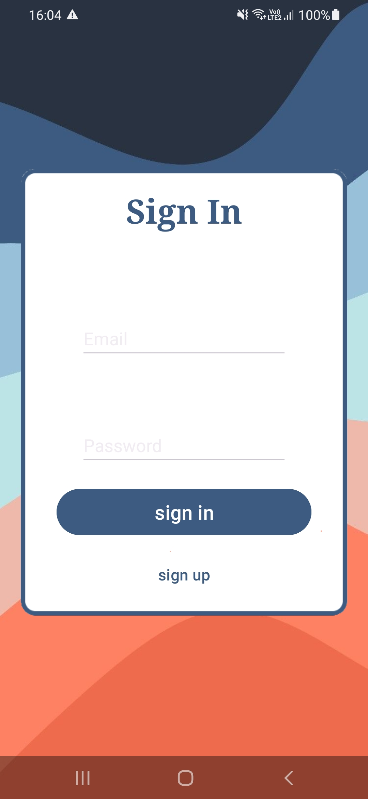

# Vega Prototype

(EN)A Prototype of a CRUD using Android Studio

(PT)Um protótipo de CRUD usando Android Studio

## About
(EN)For now the project only presents an authentication system using Firebase, however, the objective is to transform it into a complete CRUD.

As it is a simple project, Android Studio's own documentation was enough for a smooth development without major problems.

(PT)Por equanto o projeto apresenta apenas um sistema de autenticação fazendo o uso do Firebase, no entanto, o objetivo é transforma-lo em um CRUD completo.

Como se trata de um projeto simples, a documentação do próprio Android Studio foi o suficiente para um desenvolvimento sem grandes problemas.

## Screenshots

## Color Reference

| Color             | Hex                                                                |
| ----------------- | ------------------------------------------------------------------ |
| Example Color |  #EC6B4D |
| Example Color |  #3D5B80 |
| Example Color |  #FFFFFF |

## Authors

- [@kolgry](https://github.com/kolgry)

## 🛠 Skills
Java, Android Studio & Figma

## License

[MIT](https://choosealicense.com/licenses/mit/)

